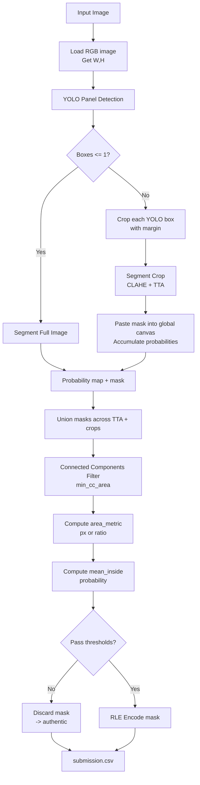
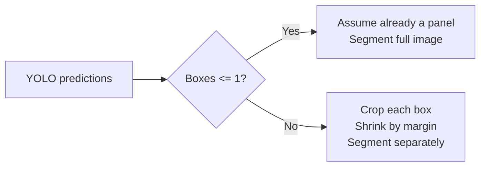
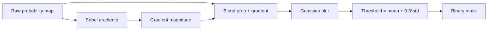
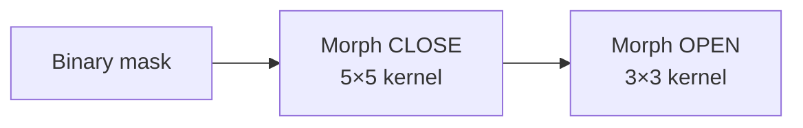
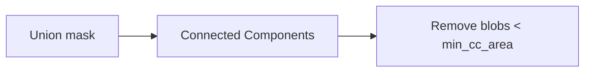
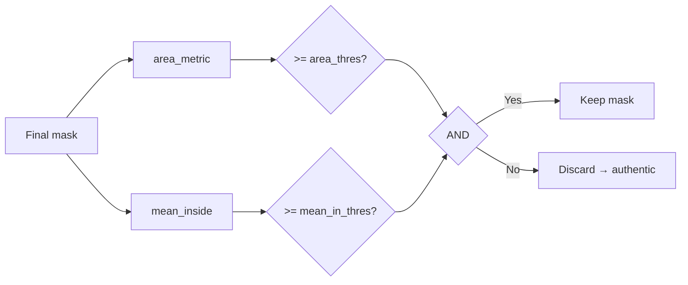
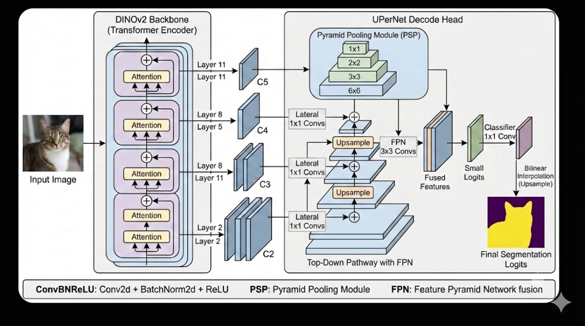
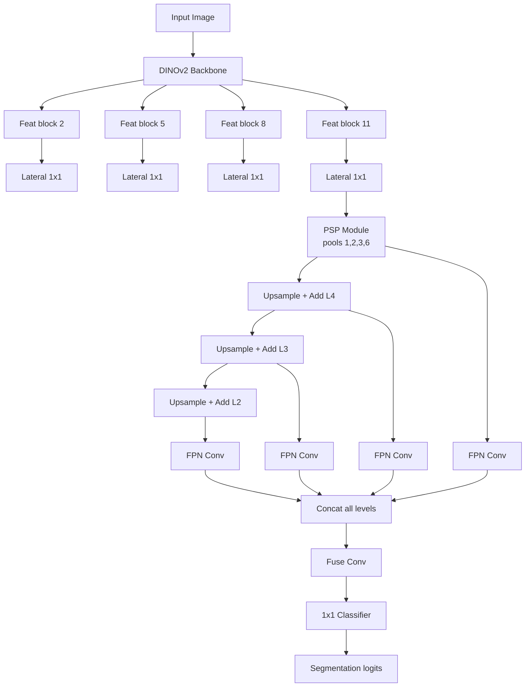

# Recod.ai Final Submission – Complete Inference Walkthrough
**YOLO + DINOv2 (ViT) + UPerNet + Robust Post-Processing**

This document explains **every single step** performed in my final submission
notebook for the Recod.ai scientific image forgery localization competition.

The explanation strictly follows the **actual execution order** of the code,
from image loading to `submission.csv`, and includes **visual Mermaid diagrams**
to make each stage intuitive.

---

## 1. Problem statement (what we are solving)

Given an input scientific image, predict:
- either `"authentic"` if no manipulation exists, or
- an **RLE-encoded pixel-level mask** of forged regions.

Challenges:
- Images may already be **cropped panels**
- Some images contain **multiple sub-panels**
- Forged regions are often **small and low-contrast**
- Naive segmentation produces many false positives

---

## 2. High-level strategy (one sentence)

> Use YOLO to decide *where to look*, DINOv2 + UPerNet to decide *what is forged*,
and disciplined post-processing to decide *whether the prediction is trustworthy*.

---

## 3. End-to-end inference pipeline



## 4. Environment & setup (notebook preamble)

- Ultralytics YOLO installed offline (Kaggle-safe)
- PyTorch + HuggingFace Transformers
- OpenCV for image processing
- Matplotlib only for debug visualization

The notebook automatically switches between:

- Submission mode (test images → CSV only)
- Debug mode (train/supp images → visualize + score)

## 5. Core Configuration & Calibration

#### Global parameters

- `img_size = 532` → segmentation input resolution
- `margin = 20` → shrink YOLO boxes inward


#### Model-specific post-processing calibration

Each trained checkpoint has its own tuned parameters:

- `area_thres`
- `mean_in_thres`
- `min_cc_area`
- (optional) `use_area_ratio = True`

This avoids instability caused by different confidence distributions.


## 6. Preprocessing – CLAHE (contrast enhancement)

Before segmentation, each image (or crop) is enhanced using CLAHE:

- Convert RGB → LAB
- Apply CLAHE on L channel
- Convert back to RGB

Why

- Enhances subtle manipulation artifacts
- Improves robustness after resizing and normalization


## 7. Segmentation inference with Test-Time Augmentation (TTA)

For every image or crop, segmentation runs with three TTAs:

- no flip
- horizontal flip
- vertical flip

For each TTA:

Apply flip

1. Forward pass through model
2. Apply sigmoid(logits)
3. Unflip probability map
4. Convert to binary mask

Merged outputs:

- **Union of binary masks** → improves recall
- **Max probability map** → used for confidence gating


## 8. YOLO-guided cropping logic (critical insight)



Why this matters

- Many dataset images are already cropped
- Cropping again removes forged regions
- This single rule improved stability more than changing architectures


## 9. Adaptive probability → mask conversion

Instead of fixed thresholding, an adaptive, gradient-aware method is used.



Intuition

- Probability → confidence
- Gradients → boundaries
- Combining both produces cleaner masks


## 10. Morphological cleanup

After thresholding:



- **CLOSE** fills small holes
- **OPEN** removes tiny speckles


## 11. Crop merging & global connected components

If multiple crops exist:

- Each crop mask is pasted back to original coordinates
- Overlapping probabilities are averaged
- Binary masks are unioned

Then once globally:



This avoids fragmented predictions and noise.


## 12. Final authenticity gating (most important step)

A predicted mask is accepted only if both conditions pass:

1. **Area metric**

- Pixel count OR
- Area ratio (if enabled)

2. **Mean probability inside mask**

- Average confidence of predicted region




This prevents:

- Small noisy blobs
- Large but low-confidence regions


## 13. Output formatting

- Non-empty mask → Run-Length Encoding (RLE)
- Empty mask → "authentic"

Saved as:

```
case_id,annotation
```

in **submission.csv.**


## 14. Model architecture – DINOv2 + UPerNet

### Backbone: DINOv2 (Vision Transformer)

- Patch size: 14×14
- Extract intermediate features from transformer blocks:
(2, 5, 8, 11)
- CLS token removed
- Tokens reshaped into spatial feature maps

### Decoder: UPerNet

- PSP (Pyramid Scene Parsing) module for global context
- FPN-style (Feature Pyramid Networks) top-down fusion
- Multi-scale aggregation
- 1×1 classifier → segmentation logits


## 15. UPerNet architecture (visual)

## 15. UPerNet architecture (visual)

<p align="center">
  
  <br/>
  <em>DINOv2 backbone with UPerNet decode head (PSP + FPN).</em>
</p>





## 16. Key takeaways

- Hybrid pipelines beat monolithic segmentation
- YOLO is used for spatial reasoning, not forgery detection
- Post-processing is as important as the model
- Adaptive thresholds outperform fixed ones
- Strong gating prevents leaderboard instability
- **Public leaderboard: score: 0.312 | Rank: 665/1564**